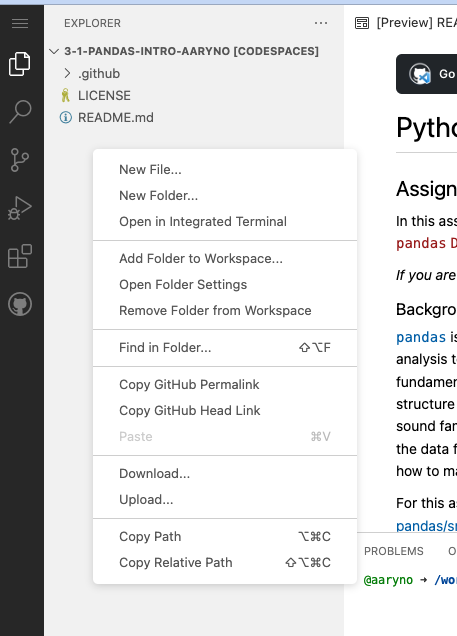
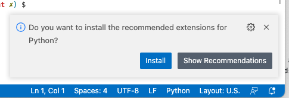
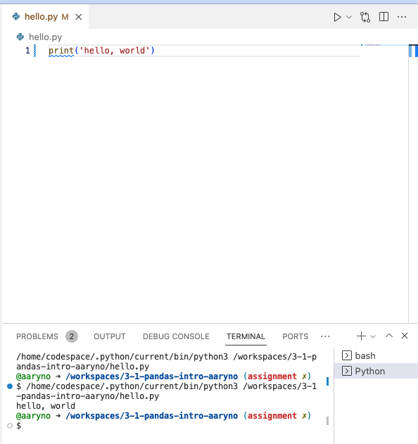

# Assignment: Codespaces Intro 
## Hello World Python

## Background

We have talked a lot about cloud resources in this class. Generally speaking, cloud resources are compute resources like virtual machines, storage, web services, etc., that are hosted by a third party, aka "cloud provider". Cloud resources are not free and are typically charged to the user in small amounts based on the number, size, or duration of the resources that the customer is using. If you want to pay for storage, for example, you might pay per GB per month. For virtual computers you may pay per CPU per minute. For network usage you may pay per GB transferred. 

With that said, a lot of cloud providers provide minimal amounts of cloud resources for free. In this class, github provides us with a number of cloud resources that are free (like hosting our files and running out CI jobs in runners). Premium services allow greater resources, higher priority resources, and additional services. One such service we will use for the rest of the semester is called Code Spaces. GitHub provides this premium service to us for free as Educational users. 

Codespaces are Virtual Machines provided to GitHub users to interact with their git repos in an advanced development environment. Learn more at https://github.com/features/codespaces. 


## Directions
### Watch class lecture
0. If you haven't already, watch the associated lecture

### Create a new branch named `assignment`.

### Setup your codespace on that branch
Click on the "Code" button and select "Codespaces" to open a drop-down menu with the normal `Local` (clone) tab and also a `Codespaces` tab. 

Click on the `Codespaces` tab and then the big green button for `Create codespace on assignment`.

Note that this will create a new `Codespace` VM environment and associate it with the `assignment` branch. 


When you do, it will open another browser tab where your environment will be set up. You can interact with this environment through this browser tab. It will not live long if you are not working with it actively so it will be up to you to save any work you have before letting it go idle for too long. When it has finally loaded it will look like this:


This environment is running [Microsoft Visual Studio Code](https://code.visualstudio.com/). This is an Integrated Development Environment, or IDE. It is [open sourced under the MIT license](https://github.com/microsoft/vscode). An IDE is a glorified text editor with built-in tools optimized for editing and interacting with programs. You may be familiar with another IDE, `PyCharm`, from another class.


In the initial state of your codespace this is what you will see:

- Explorer panel
  - You will see an expandable browsable list of files from your repo's `assignment` branch.
  - If you click on a file it will open in a new tab in the `Editor` panel.
- Editor panel
  - This automatically opens with the `README.md` file showing. It renders markdown but you can also look at the source.
- Terminal panel
  - The terminal panel is shared with a few other tabs, including `Problems`, `Output`, and `Debug Console`. The terminal is where you can type commands in your cloud workspace environment. It is a linux environment. 

### Create and run a python program in your codespace on `assignment` branch

Right click in the `Explorer` panel and select `New File`. Name the file `hello.py`.


This will create a new file which will open as a new tab in your editor.

VS Code is an IDE for many languages but each language may need its own extension for VS Code to be able to do syntax highlighting, code linting, or even running the code directly from the IDE. Fortunately, it will detect that your new file, since it ends in `.py`, is a python file and will prompt you to install the `Python` extension. This will be in the lower right hard corner of your workspace:



Install the python extension

when you click on the `Install` button it will open a new tab in the `Editor` pane showing details for the extension. This page _also_ has an `Install` button. Go ahead and press that button to install the Python extension. When it has finished you can close this tab.


```

Next, `Run` the file by clicking on the small triangle at the top right of the editor window and select `Run python file`


This will open a new tab over the `Terminal` panel. You will also see a new panel that allows you to toggle between multiple terminals



In the screenshot above it shows the Editor window with the file, `hello.py`, the Run triangle at the top right of the editor panel, and the Terminal panel with the two terminals (`bash`, which was running at the start, and `Python`, which contains the terminal output from running the program you just executed. 

### Commit and push your changes

VS Code has git integrated into it and, of course, since your workspace is already checked out from git, it already knows how to connect to your repo so this should be pretty easy.

In the far left side, next to the `Explorer` panel, find the little graph symbol, which will open the SCM (Source Code Management) panel.


Recall with GitHub Desktop changes you had to deal with staging changes:
- Add files (aka Staging files)
- Making a commit
- Pushing local commit(s) to remote repo

The same workflow will be followed here. Click on the "+" icon next to the file that needs to be added to stage it.


Next, make a commit:


That creates the commit locally (on the codespace workspace) but it still isn't pushed to the remote repo. So finally, push those to the remote (i.e., github.com)


### Update your file and make a second commit

Update your file so that it prints:

```
Hello, GIST 604B!
```

Take a screenshot of your codespace showing the full set of windows (Explorer, Editor, Terminal) after running `hello.py` with your new edits and name it `screencap-codespace.png`

### Commit your changes in a second commit

Make a _second_ commit to the `assignment` branch for this commit. Be sure this commit contains:
- updated `hello.py`
- `screencap-codepace.png`
Be sure to push your changes and then make a Pull Request.

## Deliverables
- Pull Request from `assignment` to `master` containing the following items:
  - `hello.py` which will print "Hello, GIST 604B"
  - `screencap-codepace.png`
- The `assignment` branch will have at least two commits with an earlier commit containing a `hello.py` that only printed `hello, world"


